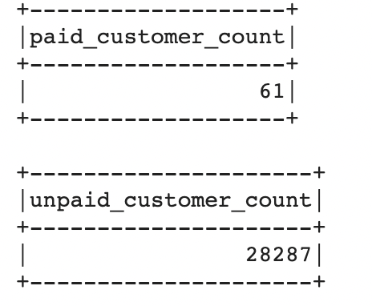
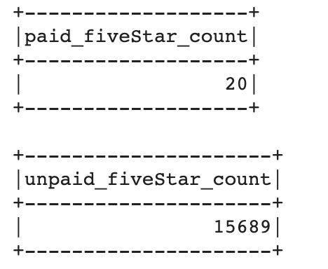
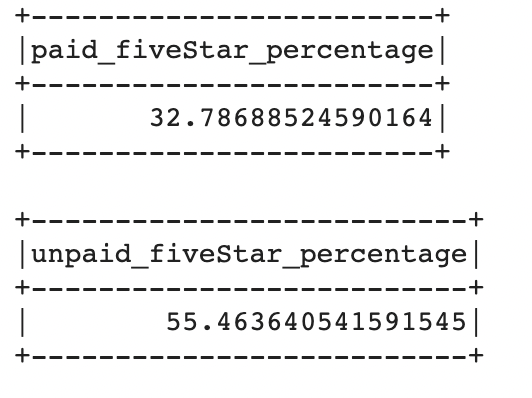

# Amazon_Vine_Analysis

## Overview of The Analysis
PySpark was used to perform the ETL process and analyze Amazon review data on groceries written by members of the paid Amazon Vine program.The Amazon Vine program is a service that allows manufacturers and publishers to receive reviews for their products. Companies pay Amazon to provide their products to the program and then have them publish reviews by the members. The analysis involved extracting the dataset, transforming the data, connecting to an AWS RDS instance, and then loading the transformed data into pgAdmin. Additionally, PySpark was used to evaluate if there is any bias toward favorable reviews from Vine members in the groceries dataset.

## Results
There were 61 Vine (paid) reviews and 28287 non-Vine (unpaid) reviews in the groceries database.

There were 20 Vine reviews that were 5 star reviews while there were 15689 non-Vine reviews that were 5 star reviews. 

Therefore 32.79% of Vine reviews were 5 star reviews and 55.46% of non-Vine reviews were 5 star reviews.

## Summary
Based on the results of this particular database, there is no bias shown when it comes to the best rated reviews and reviewers who are Vine members and therefore getting paid for their efforts. Clearly only approximately 33 percent of Vine member reviews were 5 star reviews while there was a higher percentage of approximately 55 percent of non-Vine member 5 star reviews. It is important to note that while there was a lower percentage for Vine members (supporting the fact that the data is not biased in the way explained), the sample size for Vine members is significantly lower than non-Vine members in this dataset. On one hand  it is good to think that most of the Amazon reviews for these grocery products are not done by people who were paid to review them, but this also makes me wonder if the sample size for each type of reviewer was approximately equal then would the bias shown towards 5 star reviews be different. Therefore additional analysis could be done on these products with a more equal sample size for each type of reviewer. Another way this dataset could be used to evaluate biases is by looking at the star_rating column and comparing the average ratings for Vine reviews versus non-Vine reviews to see if on average paid reviews are reviewed slightly more positively than unpaid reviews as opposed to just focusing on five star ratings.
